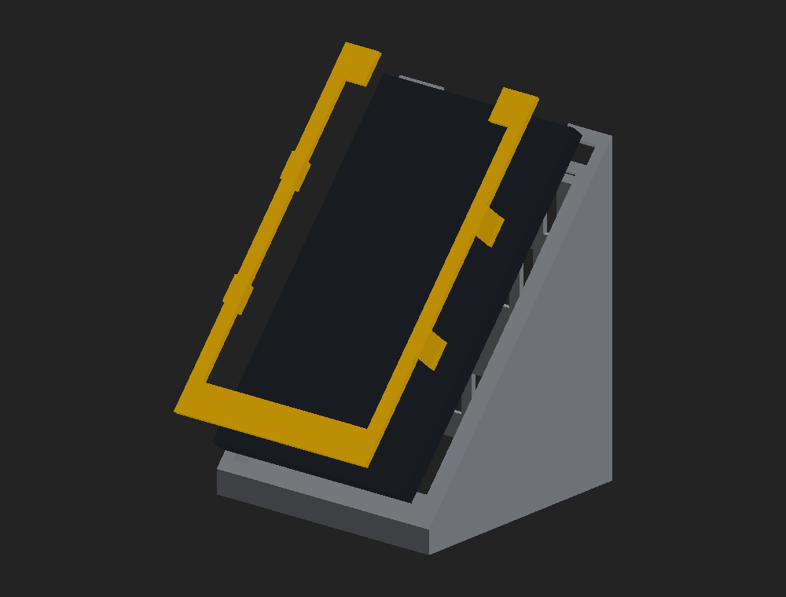
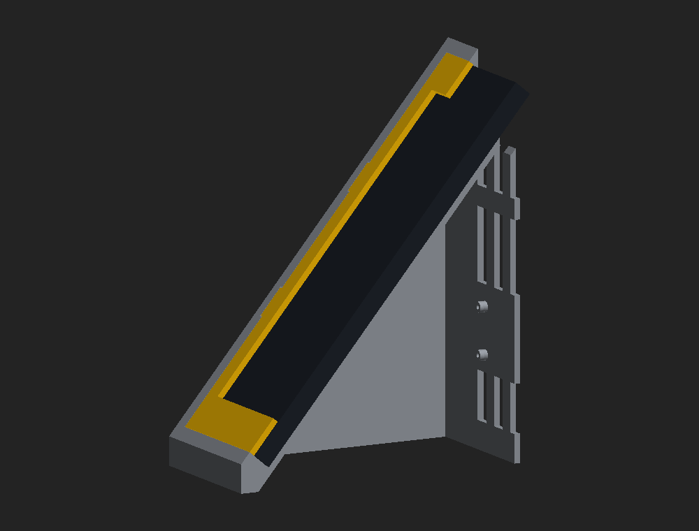
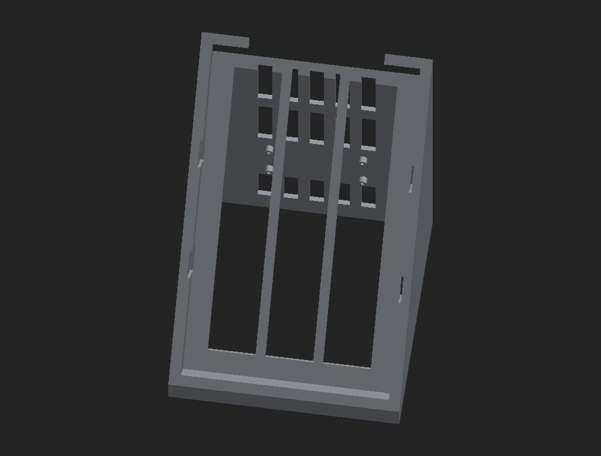

# Supporto stampabile per il tablet

Tiene il tablet inclinato a 50 gradi sul banco e contiene il Raspberry Pi.
Dal fondo aperto si monta il Pi ed escono i cavi di alimentazione e HDMI.

Due pezzi:

| pezzo   | cosa fa                                                        |
|---------|----------------------------------------------------------------|
| corpo   | cuneo cavo: tasca per il tablet davanti, vano per il Pi dentro |
| cornice | bezel che entra sopra il tablet e lo blocca, con 4 clip        |

Il tablet posa nella tasca su un bordo perimetrale e due nervature; la cornice
entra sopra e i suoi quattro ganci scattano nelle gole ricavate nelle pareti
laterali della tasca.

## Tablet di riferimento

**Amazon Fire HD 8, dalla 5a alla 8a generazione** (quelle con presa micro-USB):
214 x 128 x 9,7 mm, montato **in verticale**.

Il lato con prese e tasti va rivolto **verso l'alto**, dove c'e' il varco largo
84 mm: da li' passano il cavo di ricarica e le dita per premere i tasti, e il
cavo poi rientra nel corpo. Se lo schermo risulta capovolto, la rotazione
automatica di Android sistema tutto.

## Generare il file

Il `.3mf` e' gia' pronto nel repo. Per rigenerarlo dopo aver cambiato una quota:

    pip install manifold3d
    python3 cad/supporto-tablet.py

Lo script stampa le verifiche di montaggio e si ferma se qualcosa non torna:
controlla che il tablet entri senza interferenze, che la cornice non lo
schiacci, che le gole delle clip abbiano gioco, che le colonnine del Pi non
siano state mangiate dalle feritoie, e che la luce fra gli appoggi resti
ponteggiabile in stampa.

Tutte le quote sono parametri in cima al file. Per un altro tablet bastano
`TAB_L`, `TAB_W`, `TAB_T`; per cambiare pendenza, `INCL`.

## Stampa

| pezzo   | ingombro sul piano | orientamento                            |
|---------|--------------------|-----------------------------------------|
| corpo   | 143 x 147 mm, alto 189 mm | come si apre: posa sul fondo aperto |
| cornice | 134 x 215 mm, alta 17 mm  | piatta, clip verso l'alto           |

Entrambi i pezzi sono gia' orientati e appoggiati a z=0 nel `.3mf`: si aprono
nello slicer e si stampano cosi' come sono.

- **Materiale**: circa 250 cm3 in tutto, ossia **circa 310 g di PLA**. E' una
  stampa lunga, mettila in conto.
- **Supporti**: non servono. Le pareti sono verticali, la faccia inclinata sale
  a 50 gradi (40 gradi di sbalzo, dentro i limiti) e le nervature reggono il
  bordo alto della finestra.
- **Materiale consigliato**: PETG se il locale e' caldo, altrimenti PLA va
  benissimo. 3 perimetri, 20% di riempimento.
- La **cornice e' larga 215 mm**: su un piano da 220 restano poco piu' di 2 mm
  per lato. Controlla di avere il brim disattivato o molto stretto.

## Montaggio

1. Capovolgi il corpo e fissa il Raspberry alle quattro colonnine sulla parete
   posteriore, con viti M2,5 autofilettanti.
2. Collega alimentazione e mini-HDMI: i cavi escono dal fondo aperto.
3. Fai salire il cavo di ricarica del tablet attraverso la finestra nel fondo
   della tasca e portalo fuori dal varco in alto.
4. Posa il tablet nella tasca, con prese e tasti in alto.
5. Premi la cornice finche' i quattro ganci non scattano.

Per smontare, fai leva sulla cornice dal varco in alto.

## Se qualcosa non va

Le clip a scatto sono la parte piu' delicata: sono dimensionate per flettere
0,7 mm su 14 mm di sbraccio, che e' prudente, ma dipendono da come stampa la
tua macchina.

- **Clip troppo dure o si spezzano**: riduci `CLIP_DENTE` da 0,9 a 0,6 mm,
  oppure assottiglia `CLIP_SP` da 1,8 a 1,5 mm.
- **Cornice ballerina**: aumenta `CLIP_DENTE` a 1,2 mm.
- **Tablet che balla nella tasca**: riduci `GIOCO` da 0,5 a 0,3 mm.
- **Tablet che non entra**: aumenta `GIOCO`. Prima pero' misura il tuo tablet
  col calibro: fra una generazione e l'altra le quote cambiano parecchio.

Prima di impegnare 15 ore di stampa conviene provare solo le clip: apri il
`.3mf`, tieni la sola cornice e taglia via tutto tranne una ventina di
millimetri attorno a un gancio.
